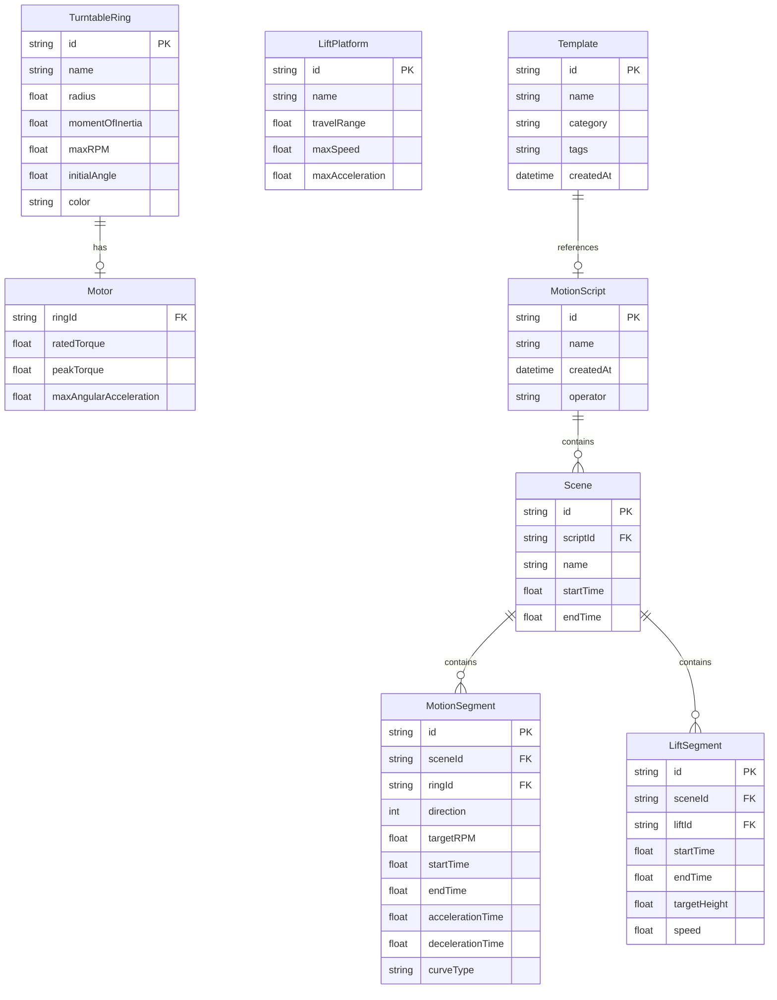

## 1. 架构设计

```mermaid
flowchart TB
    subgraph "前端层"
        "React 18 + TypeScript"
        "Tailwind CSS"
        "Zustand 状态管理"
        "React Router v6"
        "Canvas 2D 可视化"
    end
    subgraph "数据层"
        "LocalStorage 持久化"
        "IndexedDB 脚本存储"
    end
    "前端层" --> "数据层"
```

纯前端架构，数据持久化使用浏览器 LocalStorage 和 IndexedDB，无需后端服务。所有物理计算在前端完成。

## 2. 技术说明
- 前端框架：React 18 + TypeScript + Vite
- 样式方案：Tailwind CSS 3
- 状态管理：Zustand
- 路由：React Router v6
- 可视化：Canvas 2D API（转台环形预览、碰撞轨迹、同步仪表盘）
- 图表：内建简单图表组件（时间轴、折线图）
- 图标：lucide-react
- 初始化工具：vite-init (react-ts 模板)
- 后端：无（纯前端）
- 数据库：LocalStorage + IndexedDB

## 3. 路由定义
| 路由 | 用途 |
|------|------|
| / | 重定向到 /turntable |
| /turntable | 转台录入页 - 录入转台环/电机/升降台参数 |
| /choreography | 运动编排页 - 编排转速方向、启停时刻、场景时间轴 |
| /collision | 碰撞校验页 - 线速度计算、碰撞识别、安全校验 |
| /monitor | 同步监控页 - 实时误差监控、告警、脚本执行 |
| /templates | 模板库页 - 模板CRUD、导入导出、预览应用 |

## 4. API定义（无后端）

本系统为纯前端应用，所有数据通过 Zustand store + LocalStorage/IndexedDB 管理。

### 4.1 核心数据类型

```typescript
interface TurntableRing {
  id: string;
  name: string;
  radius: number;
  momentOfInertia: number;
  maxRPM: number;
  initialAngle: number;
  motor: {
    ratedTorque: number;
    peakTorque: number;
    maxAngularAcceleration: number;
  };
  color: string;
}

interface LiftPlatform {
  id: string;
  name: string;
  travelRange: number;
  maxSpeed: number;
  maxAcceleration: number;
}

interface MotionSegment {
  id: string;
  ringId: string;
  direction: 1 | -1;
  targetRPM: number;
  startTime: number;
  endTime: number;
  accelerationTime: number;
  decelerationTime: number;
  curveType: 'trapezoidal' | 's-curve';
}

interface LiftSegment {
  id: string;
  liftId: string;
  startTime: number;
  endTime: number;
  targetHeight: number;
  speed: number;
}

interface Scene {
  id: string;
  name: string;
  startTime: number;
  endTime: number;
  motionSegments: MotionSegment[];
  liftSegments: LiftSegment[];
}

interface MotionScript {
  id: string;
  name: string;
  createdAt: number;
  updatedAt: number;
  operator: string;
  scenes: Scene[];
  rings: TurntableRing[];
  lifts: LiftPlatform[];
}

interface CollisionResult {
  hasCollision: boolean;
  ringIdA: string;
  ringIdB: string;
  collisionZones: CollisionZone[];
}

interface CollisionZone {
  startAngle: number;
  endAngle: number;
  startTime: number;
  endTime: number;
  severity: 'warning' | 'critical';
}

interface SyncError {
  ringId: string;
  timestamp: number;
  angleError: number;
  timeError: number;
  isStutter: boolean;
  isJitter: boolean;
}

interface Template {
  id: string;
  name: string;
  category: string;
  tags: string[];
  description: string;
  script: MotionScript;
  createdAt: number;
  updatedAt: number;
}
```

## 5. 服务器架构图（无后端）

不适用。

## 6. 数据模型

### 6.1 数据模型定义



### 6.2 数据存储DDL（LocalStorage/IndexedDB 键设计）

- `stagerig_rings`: TurntableRing[] - 转台环参数
- `stagerig_lifts`: LiftPlatform[] - 升降台参数
- `stagerig_scripts`: MotionScript[] - 运动脚本列表
- `stagerig_templates`: Template[] - 模板列表
- `stagerig_syncThreshold`: { angleError: number, timeError: number, stutterThreshold: number } - 同步阈值设置
- IndexedDB `stagerig_syncLogs`: SyncError[] - 同步误差日志（大量时序数据）

## 7. 核心计算引擎

### 7.1 线速度计算
- 环边缘线速度 v = ω × r = (2π × RPM / 60) × radius
- 衔接处相对线速度 Δv = |v_outer - v_inner|

### 7.2 碰撞轨迹识别
- 内外环反向旋转时，计算景片在两环上的角位置随时间变化
- 当两环景片角位置差小于景片宽度对应角度时标记碰撞
- 碰撞区域以角度区间+时间区间表示

### 7.3 扭矩校验
- 梯形曲线：T = I × α（转动惯量 × 角加速度）
- S形曲线：T = I × α × smooth_factor
- 校验：T ≤ ratedTorque（持续运行），T ≤ peakTorque（加减速瞬态）

### 7.4 安全校验
- 切向加速度 a_t = α × r
- 安全阈值：a_t ≤ 0.5g = 4.9 m/s²

### 7.5 复合轨迹计算
- 转台：角位置 θ(t) = θ₀ + ∫ω(t)dt
- 升降台：高度 h(t) = h₀ + ∫v_h(t)dt
- 复合坐标：(r×cos(θ(t)), r×sin(θ(t)), h(t))
